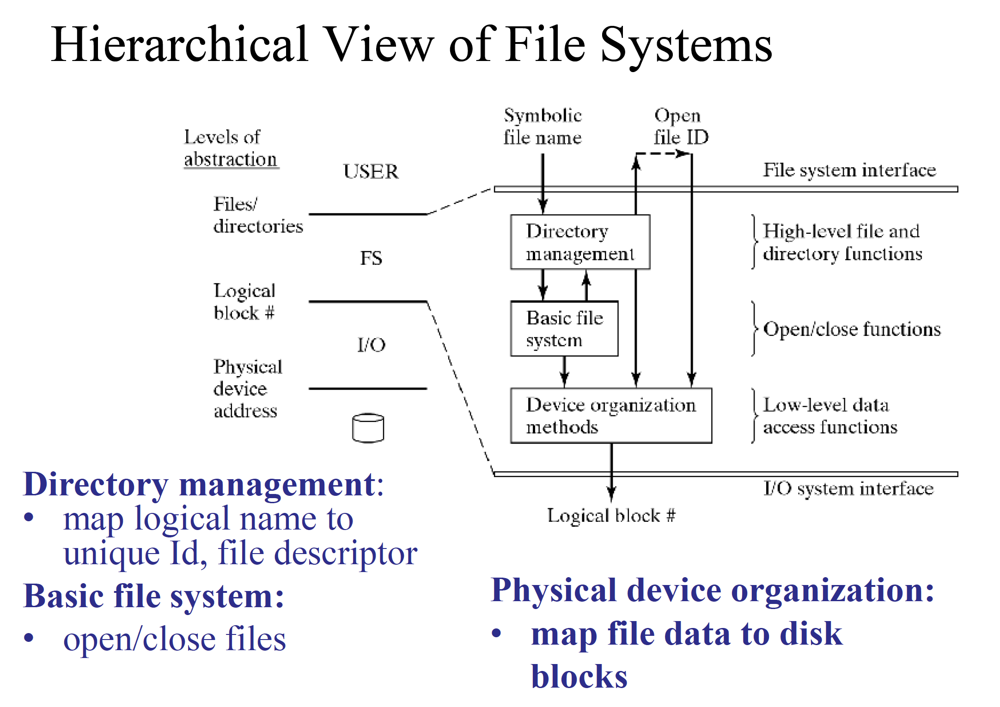
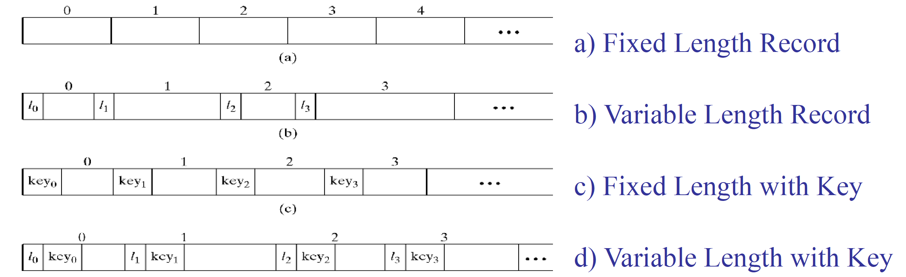
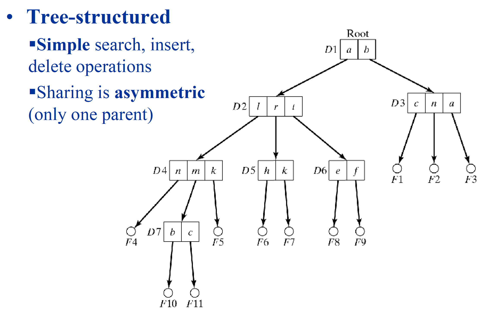
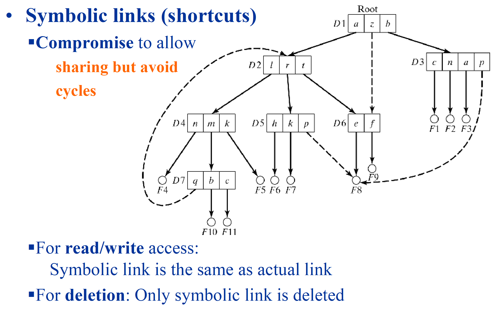
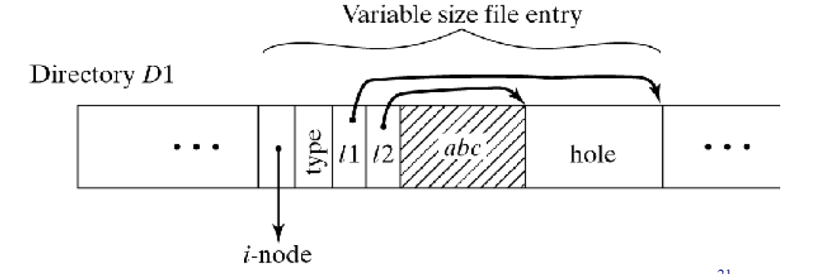
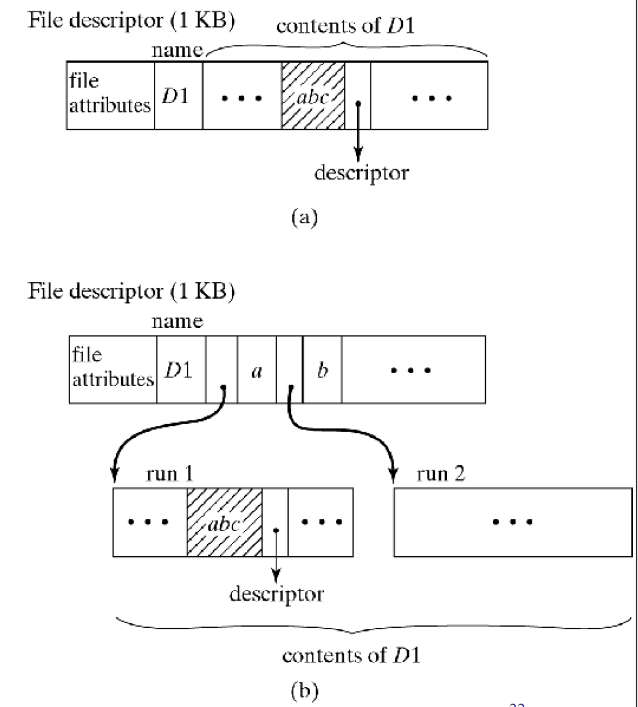

# Lecture 5 - File Systems
---
## Hierarchical View of File Systems

### Finding data

1. Platter
2. Side
3. Track
4. Block

## User's View of a File
### File name and type

1. Valid `name`
	* Number of characters
	* Lower vs upper case
	* Illegal characters cannot be used
2. Extension
	* Tied to type of file
	* Used by applications
	* Extension is actually meaningless
	* The extension is only for the user to find stuff
3. File `type` recorded in header
	* Used by the OS
	* Cannot be changed (even when extension changes)
	* Basic types: text, object, load file, directory
	* Application-specific types, e.g. .doc, .ps, .html
4. Logical file organization
	* Most common: byte stream
	* Fixed-size or variable-size records
	* Addressed
		* Implicitly (sequential access to next record)
		* Explicitly by position (record# or key)

* Variable Length with Key is used in SQL.

## Operations on Files

* Create/Delete
* Open/Close
* Read/Write (sequential or direct)
* Seek/Rewind (sequential)
* Copy (physical or just link)
* Rename
* Change protection
* Get properties
* Each involves parts of Directory Management, BFS, or Device Organization
* GUI is built on top of these functions

## Directory Management

Main Issues:

* **Shape** of data structure (e.g. tree, shortcuts, ...)
* **What** info to keep about files
* **Where** to keep it? (in directory?)
	* Not in memory, somewhere on the disk.
* **How** to organize entries for efficiency?

> **NOTE:** In linux systems, the directory structure is an acyclic directed graph.

> Windows uses a tree structure.

## File Directories

> Attributes determine whether a node is a file or a directory

> Allows sharing of files.

> Reference count determines whether to delete the file already or not.

> In symbolic links, the symbolic link is the same as the actual link.

> Upon deleting the actual file, the symbolic link file will try to find a missing file.

## UNIX Hard Links
Unix allows the same underlying file to have more than 1 filename, i.e. can create multiple references

	% echo hello >test1
	% ln test1 test2
	% ls -li test[12]
	
	5000 -xrw-r--r-- 2 joe users 6 Apr 1 00:00 test1
	5000 -xrw-r--r-- 2 joe users 6 Apr 1 00:00 test2
	
	% cat test2
	hello
	
> inode #5000 indicates that test1 & test2 refer to same file object.

* Newly created regular file only has one reference, e.g. 1 link
* Any file object can have multiple filenames (pathnames) which are aliases created with a hard link (link() system call)
	* E.g. any change to test1 is reflected in test2 since its the same underlying file object, if either test1/test2 is deleted the other file test2/test1 is not affected.
* No file removal: reference removal with unlink() system call, delete in Unix is just unlink.
	* file object can only be freed if it has no more links
* Hard links restricted to within the same filesystem (partition) on same device
* Directory entry .. is a hard link (to parent) 
* Can only link non-directories with link() (except for superuser)

## Symbolic links
Looks like hard link but NOT the same!

Creating symbolic link:
	
	% ln -s newpath file
	% ls -1 file //file -> newpath
	
> is an indirection giving a new pathname which can be resolved( again if another symbolic link)

	% ls -l /etc/x11
	
> lrwxrwxrwx 1 root root 14 Jan 1 04 x11 -> var/x11R6/lib

> indirection continues if another symbolic link, repeats until final pathname is not a symbolic link (kernel has limit on #indirections, ELOOP open error)

Symbolic link: special file where data is another pathname (absolute or relative), new pathname may itself be another symbolic link!

Provides a reference to pathname (hard link provides reference to underlying file object)

Does not correspond to making a new edge in graph like a hard link - rather another pathname (which may exist or not!)

	Can link to non-existent file
	% ln -s nosuchfile testfile
	% ls
	testfile
	% cat testfile
	cat: cannot open testfile

Can link directories (user created hard links restricted to regular files) - so can create general graphs + loops!

## Windows Shortcuts
* Only understood by GUI

## Path Names
* Concatenated local names with delimiters:
	* ( . or / or \ )
* Absolute path name: start with root
	* ( / )
* Relative path name: Start with current directory
	* ( . )
* Notation to move upward in hierarchy
	* ( .. )

## Operations on File Directories
### GUI vs Commands
* Create/delete = `mkdir`
* List: sorting, wildcards, recursion, information shown = `ls`
* Change (current, working) directory = `cd`
* Move = `mv`
* Rename = `mv`
* Change protection = `chmod`
* Create/delete link (symbolic) = `ln`, `rm`
* Find/search routines = `find`
* Change group = `chgroup`   

## Implementation of Directories
### What information to keep in each entry
* **All** descriptive information
	* Directory can become very large
	* Searches are difficult/slow
* Only symbolic **name and pointer** to descriptor
	* Needs an extra disk access to descriptor
	* Variable name length?
	* Maintain information of where the file name ends.

### How to organize entries within directory
* Fixed-size entries:
	* Use array of slots
* Variable-size entries:
	* Use linked list
* Size of directory:
	* Fixed or expanding

> Example: Windows 2000

> * When # of entries exceeds directory size, expand using B+ trees.  
> * Use trees for fast search.

## Revisit File Operations
* Assume: 
	* Descriptors are in a dedicated area
	* Directory entries have name and pointer only
* Create
	* Find free descriptor, enter attributes
	* Find free slot in directory, enter name/pointer
* Rename
	* Search directory, change name
* Delete
	* Search directory, free entry, descriptor and data blocks
* Copy
	* Like create, then find and copy contents of file
* Change protection
	* Search directory, change entry    

## Basic File System
* Open/Close files
	* Retrieve and set up information for efficient access:
		*	get file descriptor
		*  manage open file table
* File descriptor (i-node in Unix)
	* Owner id
	* File type
	* Protection information
	* **`Mapping to physical disk blocks`**
	* Time of creation, last use, last modification
	* Reference counter  